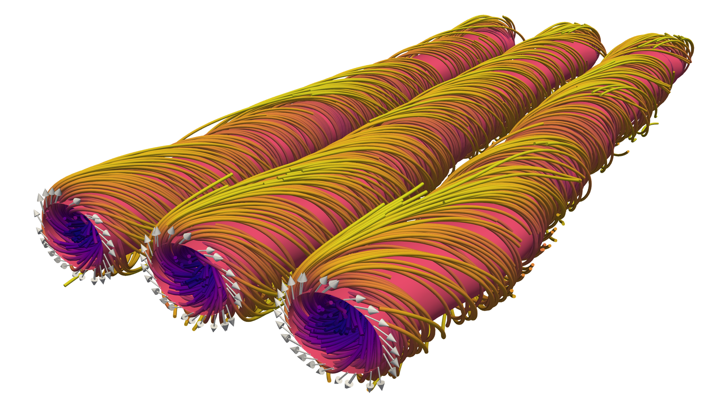

# Data set for: Real-space Imaging of Confined Magnetic Skyrmion Tubes

Run the notebooks online: 

Zenodo:                   

This repository contains the scripts, notebooks and experimental data to
reproduce the figures, simulations and numerical data shown in **Real-space
Imaging of Confined Magnetic Skyrmion Tubes** by *M. T. Birch, D.
Cortés-Ortuño,  L. A. Turnbull, M. N.  Wilson, F. Groß, N.  Träger, A.
Laurenson, N. Bukin, S. H. Moody, M.  Weigand, G. Schütz, H. Popescu, R. Fan,
P. Steadman, J. A. T. Verezhak, G.  Balakrishnan, J. C. Loudon, A. C.
Twitchett-Harrison, O. Hovorka, H. Fangohr, F. Ogrin, J.  Gräfe and P. D.
Hatton*.

Both simulation and experimental data analysis are performed using Python with
the Matplotlib, Jupyter, Scipy, Numpy and h5py libraries [1,2,3,4,5].

Jupyter notebooks are provided to process the experimental data and reproduce
the STXM, X-Ray Holography and LTEM images, which are shown as Figures 2, 3, 4
and 5 in the paper.

Simulation scripts are based on the finite difference micromagnetic code OOMMF [6]
with the extension to simulate DMI for materials with symmetry class *T*:
[oommf-extension-dmi-t](https://github.com/joommf/oommf-extension-dmi-t)

The analysis of OOMMF's output files, which are in the `OMF` format, are
processed using the [OOMMFPy](https://github.com/davidcortesortuno/oommfpy)
library [7], which can calculate the topological charge in a 2D slice. 

Three-dimensional visualisations of the magnetic states are performed using
Paraview. In order to get VTK files for visualisation, convert the `OMF` files
into `.vtk` using the `OOMMFPy` library.

## Simulations

Simulation scripts are located in [sims/oommf/](sims/oommf). Each of the
subfolders in this directory contains an OOMMF `mif` simulation script, and a
bash script to run the simulations used in the paper. These simulation scripts
are parametrised so they can be customised by tuning the magnetic parameters
and the protocols (such as the range of fields in the field sweep simulations).

### Simulation details

- `sk_tubes_helices_FeGe_Lx1000nm_Ly100nm_Lz1000nm`: simulation of three skyrmion tubes at different magnetic fields. The initial state is specified using three paraboloid solutions. The background can be either a conical solution or uniform field along the tubes. These simulations have a different coordinate system than the other simulations. Here, the `z` direction is along the tubes and the sample thickness is along the `y` direction, so in the data notebooks, the coordinate system is rotated to make `z` along the sample thickness and `y` along the skyrmion tubes. Simulations used in the paper start from the solution with a uniform backgound (files are named `no-helix`).
- `conical_FeGe_Lx1000nm_Ly100nm_Lz1000nm`: simulation of conical phase using a spin spiral initial state
- `mixed_phases_FeGe_Lx1000nm_Ly100nm_Lz1000nm_ROT`: simulation of spirals in 45 degrees, a skyrmion lattice and a field polarised region in the same system
- `m_random_FeGe_Lx1000nm_Ly100nm_Lz1000nm`: simulation of random states at zero field. In addition, scripts to run field sweep simulations in the `Bz` and `By` directions are included. Field sweep simulations start from the random equilibrium states and finish at a strong magnetic field around 300 or 400 mT.
- `sk_lattice_helices_FeGe_Lx1000nm_Ly100nm_Lz1000nm`: simulation of a skyrmion lattice at different fields. The initial state is specified using a triple-Q spiral, which is a well known analytical model for a skyrmion lattice.
- `spirals_helices_FeGe_Lx1000nm_Ly100nm_Lz1000nm`: simulation of a spiral/helical solution at zero (or any) field.

## Notebooks

Notebooks with the analysis of the data are in the [notebooks](notebooks)
folder. These notebooks rely heavily on the
[OOMMFPy](https://github.com/davidcortesortuno/oommfpy), Jupyter, Matplotlib,
Scipy and Numpy libraries. 

The best documented and self-explained notebook is the
[sk_tubes_field_sweep.ipynb](notebooks/sk_tubes_field_sweep.ipynb) Jupyter file
where simulations from three tubes and a field sweep process are analysed. The
notebooks show the calculation of averaging the magnetisation through the
thickness, isocontours of the skyrmion tubes, distance between skyrmions and
the sample edges, distance between skyrmion-skyrmion, topological charge
density and profiles of slices of the skyrmion tube. Notice that the coordinate
system from the data used in this notebook is rotated, so `y->z`, `z->y` and
`x->-x`.

The rest of the notebooks follow this procedure: load the `omf` files from
OOMMF using OOMMFPy, plot slices of the sample, compute the average of the out
of plane magnetisation component across the thickness of the sample, save this
data, plot this data.

## Experimental data

To reproduce the Figures obtained from the experimental data in the paper,
notebooks are provided in corresponding subfolders in the
[experimental](experimental) directory. These subfolders contain data from both
Holography and STXM images. Specifically, the notebooks in the `Figure_x`
directories show how the STXM data is processed and compared with the results
of the simulations and LTEM and X-Ray Holography images. Data files obtained
from simulations are provided as text files and can be reproduced from the
OOMMF simulations (see above). Additionally, the notebooks in the
[experimental/holography_reconstruction](experimental/holography_reconstruction)
contain the methods to process and generate the X-Ray Holography images.

## Reproducible

You can run the Jupyter notebooks online by pressing the Binder badge at the
top of this README file. Launching the notebooks in this way creates a
temporary copy of this repository, allowing it to be run and altered in real
time in your web browser. Notebooks in the [experimental](experimental) folder
can reproduce most of the Figures shown in the publication.

# Cite

If you find this material useful please cite us (you might need the LaTeX's
`url` package)

    @Misc{Birch2020,
      author       = {M. T. Birch and D. Cort\'es-Ortu\~no and  L. A. Turnbull and M. N. Wilson and F. Gro\ss and N. Tr\"ager and A.~Laurenson and N. Bukin and S. H. Moody and M. Weigand and G. Sch\"utz and  H. Popescu and R. Fan and P.~Steadman and J.~A.~T.~Verezhak and G. Balakrishnan and J. C. Loudon and A.~C.~Twitchett-Harrison and O. Hovorka and H. Fangohr and F. Y. Ogrin  and J. Gr\"afe and P. D. Hatton},
      title        = {{Data set for: Real-space Imaging of Confined Magnetic Skyrmion Tubes}},
      howpublished = {Zenodo \url{doi:10.5281/zenodo.3618835}. Github: \url{https://github.com/davidcortesortuno/paper-2020_real-space_imaging_of_confined_magnetic_skyrmion_tubes}},
      year         = {2020},
      doi          = {10.5281/zenodo.3618835},
      url          = {https://doi.org/10.5281/zenodo.3618835},
    }

# References

[1] *Matplotlib: A 2D Graphics Environment*. J. D. Hunter. Computing in Science
& Engineering, vol. 9, no. 3, pp. 90-95, 2007.

[2] *IPython: A System for Interactive Scientific Computing*. Fernando Pérez
and Brian E. Granger. Computing in Science & Engineering, 9, 21-29 (2007),
DOI:10.1109/MCSE.2007.53 (publisher link)

[3] *SciPy: Open Source Scientific Tools for Python, 2001-*. Jones E, Oliphant
E, Peterson P, et al., http://www.scipy.org/ [Online; accessed 2019-08-09].

[4] *A guide to NumPy*. Travis E, Oliphant. USA: Trelgol Publishing, (2006).

[5] *Python and HDF5*. Collette, A. O’Reilly Media (2013).

[6] *OOMMF User's Guide, Version 1.0*. M.J. Donahue and D.G. Porter.
Interagency Report NISTIR 6376, National Institute of Standards and Technology,
Gaithersburg, MD (Sept 1999) 

[7] *OOMMFPy*. D. Cortés-Ortuño. Zenodo doi:10.5281/zenodo.2611194. Github:
https://github.com/davidcortesortuno/oommfpy (2019)

[8] *Binder 2.0 - Reproducible, Interactive, Sharable Environments for Science
at Scale*. Jupyter et al. Proceedings of the 17th Python in Science Conference.
doi://10.25080/Majora-4af1f417-011 (2018)
